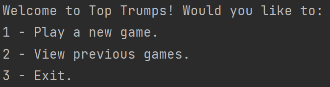
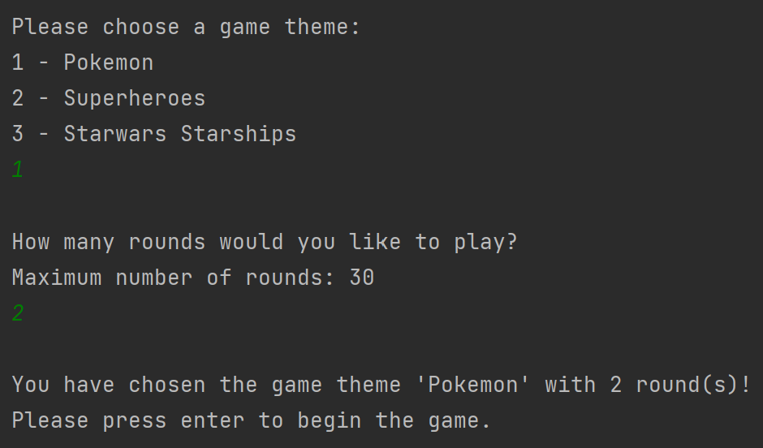
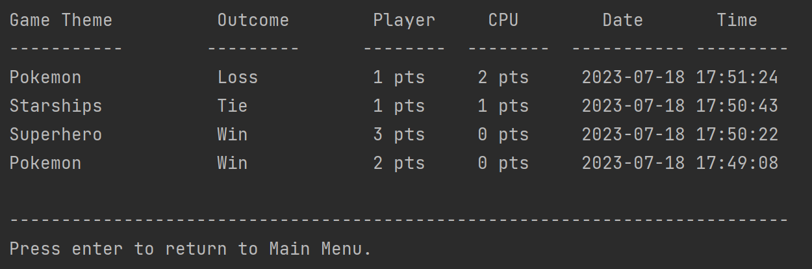
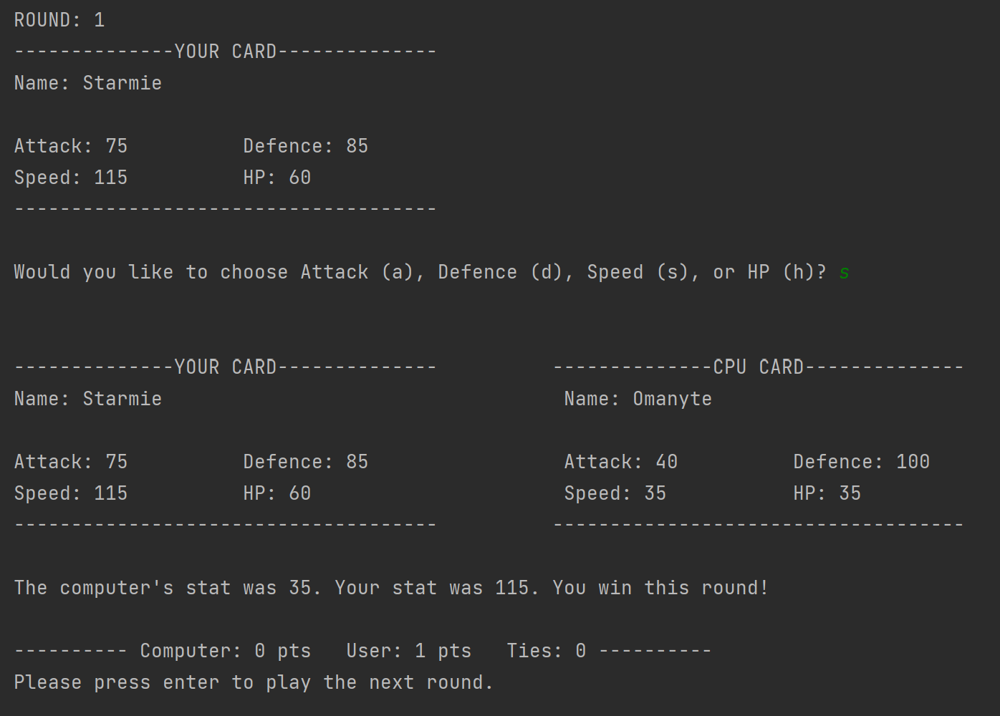
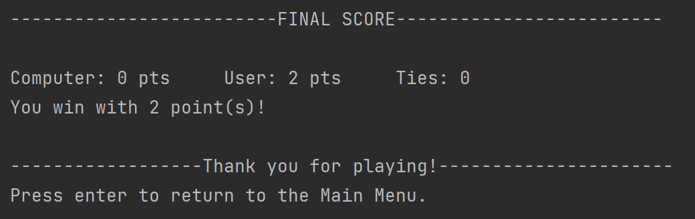

# Top Trumps Game 

  
Table of Contents

  <ol>
    <li><a href="#about-the-project">About The Project</a>
      <ul>
        <li><a href="#main-menu">Main Menu</a></li>
        <li><a href="#creating-a-new-game">Creating a New Game</a></li>
        <li><a href="#game-history">Game History</a></li>
        <li><a href="#game-rounds">Game Rounds</a></li>
        <li><a href="#final-score">Final Score</a></li>
      </ul>        
    <li><a href="#built-with">Built With</a></li>
    <li><a href="#challenges">Challenges</a></li>
    <li><a href="#contact">Contact</a>
  </ol>

## About the Project
This project was created as my final team project for the CodeFirstGirls Python and Apps course I participated in. We were given three briefs to choose from, and my partner and I chose to create a Top Trumps game. In our last session in the course we had to present our project. Our project won the best project title and we were given certificates of distinction.

This project aims to immitate the famous Top Trumps game using external, third-party API's. During the game, the user is presented a card from which they have to choose a stat. The stat is compared against the same stat on the CPU's card, and the higher stat wins the round and gains a point. At the end, the player with the highest number of points wins. Previous game history with timestamps and details can be viewed.

### Main Menu
When the program is run, it prompts a Main Menu for the user. The user has the option to play a new game, view previous games or exit the program.

    

### Creating a New Game
If the user chooses to play a new game, the program begins to prepare for the game. The program prompts the user to choose a card theme and number of rounds to play.

    

### Game History
If the user chooses to view game history, they are provided with the following screen. The program records game history to a .txt file at the end of every round, including details such as game theme, game outcome and the date and time. The most recent game is appended at the top.

    

### Game Rounds
When the user chooses to play a new game and has set up the game parameters, the following screen appears. In each round, the round number and card is displayed, and the user is asked to choose a stat. The CPU's card is displayed, the users stat and computers stat is compared, and the winner of the round is displayed. The total points is always displayed at the end of each round.

    

### Final Score
At the end of the game when all the rounds have been played, a final score screen is displayed. It shows the total scores for the CPU and the user, and displays the outcome of the game. These details are then recorded to a .txt file so that they can be viewed later.

    

## Built With
This project was built using the following technologies and languages:
- Python
- External/Third-Party API's:
    - <a href="https://pokeapi.co/">PokeAPI</a>
    - <a href="https://superheroapi.com/">SuperHero API</a>
    - <a href="https://swapi.dev/api/starships/">SWAPI - The Starwars API</a>

## Challenges
This project used multiple API's so that the user could choose a "game theme" but this proved very difficult. The three API's behaved very differently to eachother, and so required their own specific code in order to work as intended. 

- The <a href="https://superheroapi.com/">SuperHero API</a> used for the Superhero theme had `null` values, which made it difficult for the program to compare stats. This was solved by coding the program to loop through random ID's until a card without any `null` values was found.
- The <a href="https://swapi.dev/api/starships/">SWAPI Starwars Starships API</a> had their floats and integer values as strings in the JSON. Sometimes these values also contained commas and units (such as 'km'), making it difficult to convert to integers or floats. This issue was tackled using the `.replace` method.
- The <a href="https://swapi.dev/api/starships/">SWAPI Starwars Starships API</a> also only had specific ID's for the starwars starships. These ID's had to be searched and put into a list. A random element is drawn from this list to choose an ID.

Additionally to these points, many external, third-party API's do not use numerical, unique ID's, and actually require you to search the name of the item you were looking for. This was not plausible as we could not generate a name randomly as easily as we can with integers.

## Contact

  <a href="https://www.linkedin.com/in/nahdaa-jawed/">My LinkedIn</a>
  
nahdaajawed@gmail.com

